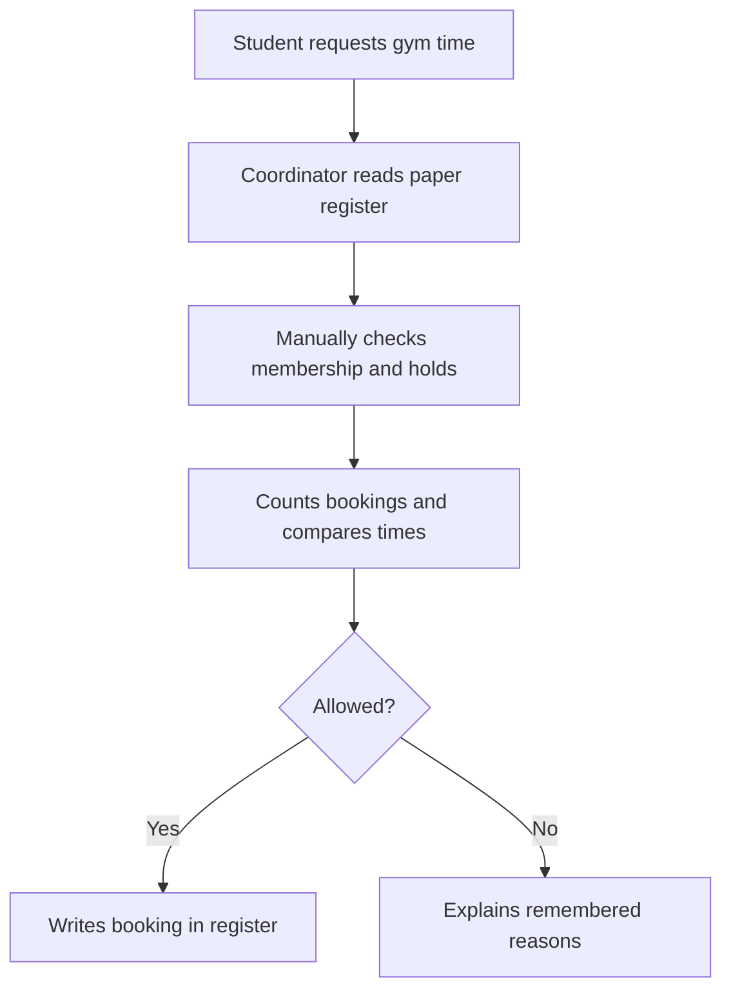
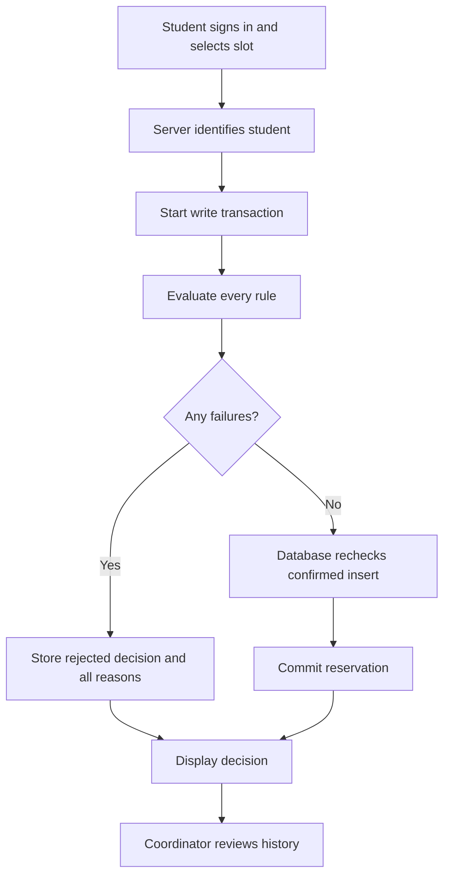

# Gate 0 — Problem Approval

S0 · weeks 1–2 in the college schedule · 5 marks · CO1.
Prepared 2026-10-06. Gate decision: **HUMAN EVIDENCE PENDING**.

## Problem and stakeholders

Proposed problem: a paper gym register can admit a booking despite expired membership, a hold,
missing profile data, full capacity or a timetable conflict. The record at risk is the **slot booking
decision**. These are plausible needs supplied by the brief, not observed incident statistics.
Students need an explainable decision and cancellation; the gym coordinator needs reliable lists
and visible reasons; the admin needs control of membership, status, slots and dated rule values.
Faculty needs a runnable five-subject integration and individual explanations from four members.
Real stakeholder names, interviews and AS-IS validation: **HUMAN EVIDENCE PENDING**.

## AS-IS workflow (hypothesis for stakeholder review)

## TO-BE workflow

## Scope

Local demonstration with Student, Coordinator and Admin logins; existing fictional accounts;
profile/status/membership views and admin edits; dated same-day slots; capacity; booking,
all-reason rejection, cancellation, history; configurable daily limit; all four engines.

Out of scope: payments, OTP, membership sales, real personal data imports, attendance/admission
checking, recurring timetable expansion, notifications, multi-campus deployment, password recovery,
forgotten passwords, public hosting and an immutable administrative audit system.

## Feasibility and risks

| Area | Decision / mitigation |
|---|---|
| Technical | Python/Flask/SQLite, six tables, server-rendered forms, standard-library tests |
| Cost | Local computer; free software, no recurring service dependency |
| Team | One owner per engine; names and actual contribution need team confirmation |
| Concurrency | BEGIN IMMEDIATE serializes booking decisions; DB trigger also checks capacity |
| Rule bypass | Validate on server and confirmed INSERT/UPDATE at database |
| Clock / stale demo | IST timestamps for scheduling; seed tomorrow on initialization |
| Unclear college rubric | Source reconciliation flags three/four engines and algorithm wording |
| Evidence honesty | Synthetic data and automated measurements labelled; no invented field study |
| Changing records | Historical approvals not automatically revoked; mentor confirms policy |

## Governing rule

**Confirm a gym slot booking only when the student is active, has a complete profile and a currently
active membership covering the slot, has no hold, chooses an active future slot with capacity,
has no duplicate or overlapping confirmation and stays within the applicable dated daily limit;
otherwise store and show every failing reason.**

## Integration Map v1 (proposed, not a historical week-one artifact)

| Subject | Planned engine / concept | Gate 0 demonstration |
|---|---|---|
| DBMS | E1: accounts, students, membership, slots, decisions, policy | Explain why invalid decisions must be stopped by DB |
| Data Structures & Programming | E2: interval comparisons + full reason list | Work one overlapping-slot example on paper |
| Web Technologies | E3: requests and three role views | Identify each role and allowed operations |
| SE & SDLC | E4: FRs, tests, RCA, KPI and honest evidence | Show gate order and evidence plan |
| OOP | RuleEngine responsibility, reused by service/tests | Explain why decision logic is separated from HTML |

Assessment pointers: A1 problem/stakeholders; A2 diagrams; A3 scope/feasibility/risks;
A4 map above; B1 governing rule and booking record. Each row CO1, maximum 1 mark.
Student weakest point: real AS-IS workflow has not been verified by a stakeholder.
Decision-level prompt: is this need real enough to approve? Answer requires the actual interview.
