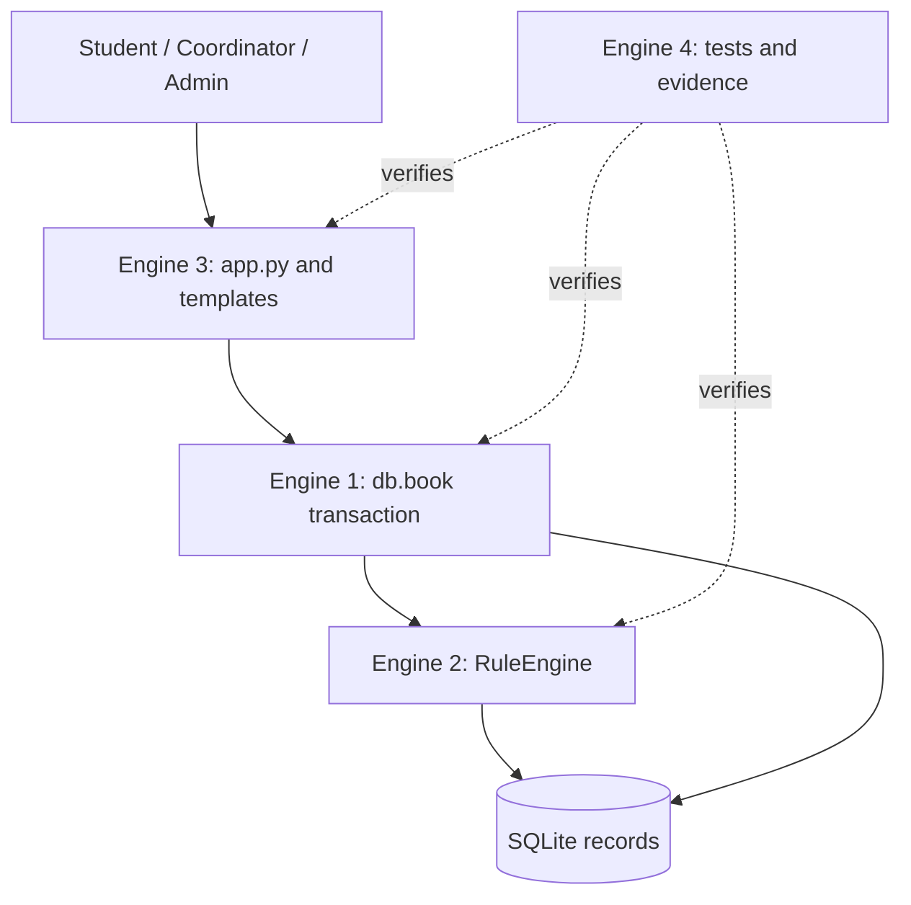
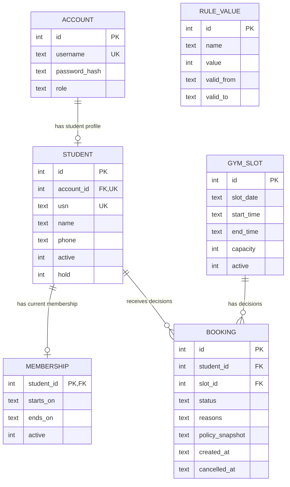

# Gate 2 — Architecture & Interface Design

S2→S3 · Sprint 1 · weeks 5–7 · 10 marks · CO3. Prepared 2026-10-06.
**Conflict:** current PPT slides 5/13/28 require four engines; Word Gate 2 A1 says three.
Four implemented. Mentor confirmation of adapted sheet and algorithm sufficiency is pending.

## Four-engine architecture

OOP: `RuleEngine(connection)` owns decision logic and `find_conflicts`; it is reused by the booking
service, unit tests and KPI measurement. `GymTests(unittest.TestCase)` reuses setup/teardown and
assertions. DB functions own persistence; Flask's application factory owns HTTP lifecycle.
No unnecessary inheritance hierarchy or repository/service framework.

## ER diagram and normalization

`rule_value` is selected by name plus slot date; it is not a foreign-key parent of booking.
A decision keeps its policy snapshot so later parameter edits do not rewrite its explanation.
Student identity is not repeated in each booking. Slot times/capacity belong to gym_slot, not
booking. Membership is one current record per student (no renewal history in scope).
Confirmed occupancy is derived, not stored; this avoids inconsistent counters. Reasons and
policy_snapshot are bounded JSON decision evidence, an intentional small-project denormalization.
No separate reason/audit table is needed. Account may have no student profile (staff roles).

## Keys, domains, constraints and indexes

- All six tables have primary keys. account.username, student.account_id, student.usn and
  slot date/start/end are unique. Confirmed student/slot is a partial unique index; rejected
  retries and rebooking after cancellation remain allowed.
- Required data uses NOT NULL. Name/USN must be nonempty. Phone may be empty so incomplete
  profiles can exist, but cannot gain a confirmation. Roles and flags use CHECK domains.
- Dates must be canonical calendar dates; times are canonical HH:MM; start < end; no overnight
  slots. Membership start <= end. Capacity integer 1–200; daily limit integer 1–10.
- Foreign keys connect profile/account, membership/student, booking/student and booking/slot.
  `connect` enables them on every connection. There is no cascade delete that erases history.
- booking reasons must be a valid JSON array; rejected rows require a reason, other states [];
  the confirmed-row triggers independently validate eligibility (not the claimed decision text).
- Simple indexes on slot/status and student/status support count/lookup; slot_date index assists
  date lookup. Do not claim measured index-speed improvements; this project is Theme 1.
- Triggers implement cross-row conditions because SQLite CHECK cannot contain subqueries.
  The insert/update versions deliberately repeat the readable guards instead of a framework.
  Policy periods cannot overlap. Capacity cannot shrink below occupancy; booked times cannot move.

## Interface contracts

| Caller -> callee | Inputs | Output / mutation | Error cases |
|---|---|---|---|
| Browser -> Flask | Session cookie, CSRF token, form fields, slot ID | HTML / redirects; 200 confirmed, 409 blocked | 400 token, 403 role, 404 missing target, 503 busy |
| Flask -> db.book | Connection, authenticated student's ID, slot ID | `{allowed, reasons, policy, checked, booking_id}`; persisted decision | ValueError missing IDs; IntegrityError DB refusal; rollback on any exception |
| db.book -> RuleEngine.evaluate | Same connection inside BEGIN IMMEDIATE | `{allowed: bool, reasons: [{id,name,message}], policy: dict, checked: 13}` | ValueError if parent records absent |
| RuleEngine -> DB | Parameterized read queries | Student, membership, slot, confirmed intervals, occupancy, dated policy | SQLite error propagates to transaction rollback |
| Flask -> db.cancel | Connection, authenticated student ID, booking ID | bool; confirmed -> cancelled with timestamp | False for wrong owner or nonconfirmed |
| Engine 4 -> other engines | Temporary DB, fixtures, requests, adversarial inputs | Assertions, logs, measured KPI JSON | Nonzero exit on test failure |

HTTP 409 is intentional for a rule-based booking refusal, not a server crash. Decisions refer to
slot IDs from stored records, never trusting posted student IDs, counts or status values.

## Algorithm / workflow and complexity

1. Authenticate role and CSRF token. Obtain student ID from the session account.
2. Start `BEGIN IMMEDIATE` before reading data. This acquires the SQLite writer lock.
3. Read student, membership, slot, existing confirmed bookings, occupancy and dated policy.
4. Hand-written `find_conflicts` scans existing intervals. Two distinct slots overlap exactly when
   dates match AND old.start < target.end AND target.start < old.end. Adjacent intervals pass.
5. Build explicit named checks R01–R13. Iterate every check, appending each failure to `reasons`.
   Do not return after the first failure. If policy is absent, R12 blocks and R13 is unknown.
6. Empty reasons means confirmed; otherwise rejected. Insert decision and policy snapshot.
7. A confirmed insert invokes DB guards R01–R13 and the unique index. If any fails, rollback.
8. Commit and display the decision. Availability is a fresh COUNT of confirmed rows.

For b prior confirmations and r checks, Python evaluation costs O(b+r) time and O(b+r) space,
including fetched records and reason/conflict lists; r=13 here. Database reads and writes add SQL
cost, so this is not a claim of whole-system constant time. SQLite serializes writers; the trigger
sees the first committed place before a second writer can confirm. Linear scanning is easier to
explain than an interval tree for the small per-student history. Test `test_conflict_algorithm_unit`
proves overlap, adjacency and another date. The user-requested algorithm satisfies the PPT's
algorithm option; Word's stricter wording remains a mentor question.

## Enforcement location

| Rules / constraints | Form | Python logic / server | Database |
|---|---|---|---|
| R01–R06 student/profile/membership/hold | Status displayed; admin fields typed | evaluate all six | booking_insert / booking_update guards |
| R07–R08 active/future slot | Slot badges, date/time inputs | evaluate slot flags and IST time | same triggers, SQLite IST clock |
| R09 capacity | Occupancy displayed | count < capacity inside transaction | count guard plus capacity domain/slot_update |
| R10 duplicate | History visible | scan existing slot IDs | trigger and unique_active_booking |
| R11 overlap | Time labels | hand-built interval scan | relational interval predicate |
| R12–R13 dated limit | Admin numeric/date form | dated lookup and same-day count | policy lookup/count guards; no overlapping periods |
| Role, CSRF, ownership | Role navigation / hidden token | before_request, roles, student_id, cancel WHERE | Not DB roles; application authorization responsibility |
| FK / canonical dates / domains | Browser input types | parsing and validation | FK, NOT NULL, UNIQUE, CHECK |

Forms alone provide convenience. Python provides all reasons. Database provides admission integrity.
Policy changes apply to future decisions; mutable parent records can make an old approval no longer
currently eligible. This is explicitly booking-time semantics, not an admission permit.

## Integration Map v2

See INTEGRATION_MAP.md: concrete files, symbols, tables, tests and gate demonstrations for all
five subjects. At this gate show `schema.sql`, `RuleEngine.find_conflicts`, contract return shape,
route role checks and Engine 4 test design. It is a version label, not a fabricated earlier commit.

Assessment pointers: A1 architecture (2); A2 ER/constraints (2); A3 contracts (2); A4 algorithm (1);
A5 map (1); B1 dated rule_value (1); B2 enforcement table (1). Total 10; no mark claimed.
